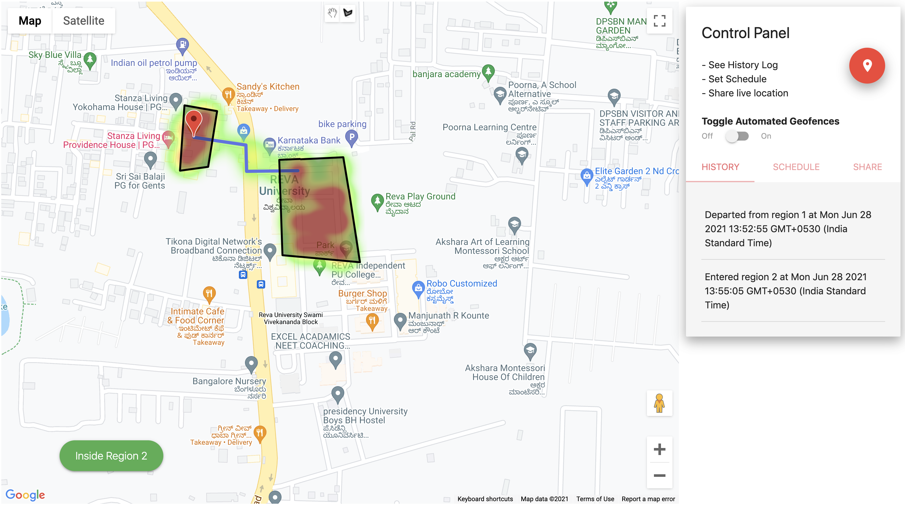

<p align="center">
    
</p>


# **WikiPills**


## Features

- 🔎 Features a multi-spot, schedule-based geofencing system to monitor the location of the patient.
- 🗄️ Stores, maintains and facilitates sharing of Electronic Health Record (EHR) of users.
- 📊 Dynamic visualizations are made available on the dashboard using chart.js library for doctors and guardians of the patient.
- 🌀 Google Firebase and AWS DynamoDB co-exist in this module. Firebase provides near real-time speed for geofencing operations. AWS DynamoDB provides a secure NoSQL database that is used throughout WikiPills for storing sensitive patient-specific data.
- 🔥 Heatmaps are populated onto the map to simulate user activity based on historical data (for demonstration purposes, sythetic data is employed here).

# Screens

### Geofencing

<p align="center">
  
</p><br>

### Dashboard

<p align="center">
  
  
  <br><br>
  
</p><br>

### Electronic Health Record (EHR)

<p align="center">
  
  
  
  
</p><br>

# Demo

- Single-spot Geofencing [[live link](https://wiki-pill.web.app/child/index.html), [video demo](https://youtu.be/2iwRkP7BQyw)]
- Multi-spot Geofencing [[live link](https://wiki-pill.web.app/child/index.html), [video demo](https://youtu.be/2iwRkP7BQyw?t=125)]
- Heatmaps (Automated Geofencing) [[live link](https://wiki-pill.web.app/child/index.html), [video demo](https://youtu.be/2iwRkP7BQyw?t=185)]
- Electronic Health Records [[live link](https://wiki-pill.web.app/patients.html), [video demo](https://youtu.be/2iwRkP7BQyw?t=275)]
- Dashboard [[live link](https://wiki-pill.web.app/dashboard.html "Analytics")] 


# Installation


Follow the given steps if you wish to customise/replace the project's DynamoDB and Firebase database instances with your own account's instances.

Installation steps for `AWS CLI` and `Firebase CLI` are given [here](https://docs.aws.amazon.com/cli/latest/userguide/cli-chap-install.html) and [here](https://firebase.google.com/docs/cli) respectively. You'll also need an AWS account (AWS Educate will work too!) to configure and setup DynamoDB.

### Configure AWS CLI for DynamoDB

- Check if AWS CLI v2.0.x is installed. If you see anything >=2.0.0 then you're good to go. <br>
  ```bash
  aws --version
  ```
- Now, configure AWS CLI with your AWS account. You'll need `aws_access_key_id`, `aws_secret_access_key`, and the `region`. If you need help finding these keys then refer [this](https://docs.aws.amazon.com/cli/latest/userguide/cli-configure-quickstart.html). <br>
  ```bash
  aws configure
  ```
- Set the `aws_session_token` using the AWS CLI. If you're using AWS Educate, then the session token is mentioned in the Vocareum portal. <br>
  ```bash
  aws configure set aws_session_token <insert-session-token-here>
  ```
- Lastly, enter these AWS tokens in the [`/public/patients.html`]() and [`/public/child/index.html`]() files.
  ```javascript
  // Replace the fields with your AWS account's credentials.
  // For security reasons, do not store AWS Credentials in your files. 
  // Use .env files to store credentials and make sure to put .env in the .gitignore file.
  region: "<enter_region_here>",
  accessKeyId: "<enter_access_key_id_here>",
  secretAccessKey: "<enter_secret_access_key_here>",
  sessionToken: "<enter_session_token_here>"
  ```
  NOTE: You may also have to add this to your HTML pages to set up AWS SDK for Javascript if you haven't already.
  ```html
  <script SameSite="None" Secure src="https://sdk.amazonaws.com/js/aws-sdk-2.7.16.min.js"></script>
  ``` 

### Configure Firebase CLI

- Check if Firebase CLI is installed properly.
  ```
  firebase --version
  ```
- Re-initialize the firebase project to link it with your account's project.
  ```
  firebase init
  ```
- Select the `Database` or `Hosting` option(s) as per your requirements. Proceed with the rest of the steps (google authentication, project selection from the list, etc.) as guided by the Firebase CLI. <br><br>
NOTE: Make sure to replace the version numbers that have been referenced in the `<script>` tags present at the bottom of HTML files. Refer [this](https://firebase.google.com/docs/web/setup#from-hosting-urls_1) to learn more about referencing different Firebase services.


# Contributors

See [CONTRIBUTORS.md](../CONTRIBUTORS.md).
